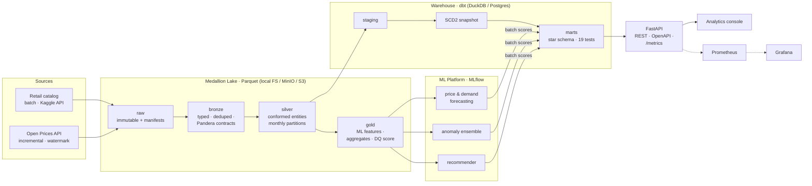
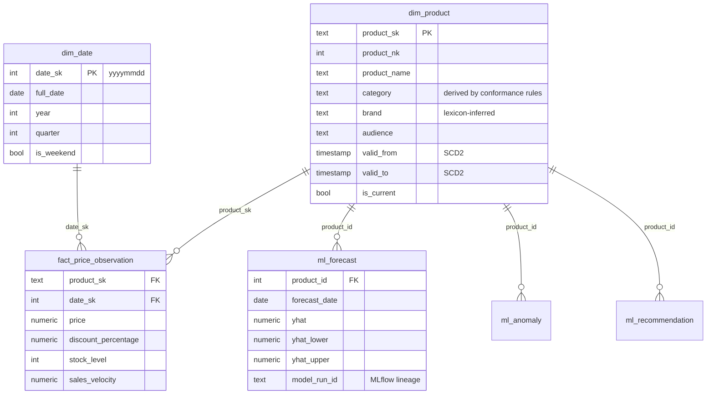

# TechTrend Enterprise Data Platform

**Intelligent e-commerce lakehouse for price intelligence, demand forecasting, and market analytics.**


TechTrend ingests real retail data, runs it through a medallion data lake with enforced data contracts, builds a dimensional warehouse with dbt (SCD Type 2, tested star schema), trains four production-patterned ML models with experiment tracking, and serves everything through a FastAPI service with a live analytics console, Prometheus metrics, and Grafana dashboards.

**Everything runs with one command, no credentials, no cloud account:**

```bash
make install && make demo && make serve   # → http://localhost:8000
```

The full 33-node warehouse build — ingestion, four-layer lake, data-quality gate, four ML models, dbt snapshot + build with 19 tests — completes in about 20 seconds on a laptop.

---

## Architecture



Rejected rows never disappear silently — they are quarantined to `raw/_rejected/` with a machine-readable `_dq_reason`, counted against the composite data-quality score, and the medallion DAG **fails the run** if that score drops below its 0.90 SLO.

## Warehouse design (star schema, SCD Type 2)



Grain is declared explicitly (`fact_price_observation` = one row per product per day), enforced by a custom dbt grain test, and facts join to the SCD2 dimension row **valid at observation time** — historical rows keep their historical attributes. Initial snapshot rows are epoch-backdated (standard SCD2 initial-load treatment). On the Postgres target, facts land in monthly `RANGE` partitions with composite and BRIN indexes (`src/techtrend/warehouse/postgres_init.sql`), alongside `ops.pipeline_audit`, `ops.ingestion_state`, and `ops.dataset_registry` operational tables.

## What each layer demonstrates

| Layer | Implementation | Production pattern shown |
|---|---|---|
| Ingestion | `src/techtrend/ingestion/` | Immutable raw landings with manifests + schema fingerprints; paginated REST client with retry/backoff and **watermark-based incremental** extraction; keyless offline mode for CI |
| Data quality | `src/techtrend/quality/` | Pandera contracts at the raw→bronze boundary; row-level **quarantine with reasons**; 5-dimension weighted DQ score gating the pipeline |
| Lake | `src/techtrend/lake/` | Medallion layers as zstd Parquet; Polars lazy scans (predicate pushdown); silver **conformance rules** turning degenerate source attributes into governed category/brand/audience dimensions with `source_*` lineage columns |
| Warehouse | `dbt/techtrend_dw/` | staging → snapshot → marts; SCD Type 2 via dbt snapshots; incremental fact with a 3-day late-arrival window; 19 tests incl. a custom grain test; same project runs on DuckDB (demo/CI) and Postgres (Docker/cloud) |
| ML | `src/techtrend/ml/` | Walk-forward backtesting (never random splits on time series); recursive multi-step forecasting with empirical-quantile confidence bands; anomaly **ensemble** (robust z + IsolationForest) governed by an explicit alert budget; MLflow tracking with local fallback |
| Serving | `api/` | FastAPI + Pydantic contracts, versioned routes, pagination/filter/sort/search, parameterised SQL only, Prometheus `/metrics`, repository layer isolating SQL from routers |
| Orchestration | `dags/` | Five DAGs with **dataset-driven scheduling** (the warehouse build triggers on silver updating, not on a clock), retries with backoff, a DQ gate that fails loudly |
| Ops | `docker-compose.yml`, `monitoring/`, `.github/` | One-command stack (Postgres, MinIO, Airflow, MLflow, Prometheus, Grafana); provisioned Grafana dashboard; CI running lint → types → tests → **the actual pipeline** → API tests → image build + Trivy scan |

## Quickstart

**Path 1 — zero-dependency demo (recommended first run)**

```bash
git clone https://github.com/YOUR_GH_USER/techtrend && cd techtrend
python -m venv .venv && source .venv/bin/activate
make install        # pip install -e ".[api,dev]"
make demo           # full pipeline: ingest → lake → DQ → ML → dbt (≈20 s)
make serve          # console at :8000, OpenAPI at :8000/docs
```

**Path 2 — full platform**

```bash
cp .env.example .env   # optionally change local-dev passwords
make up
```

| Service | URL |
|---|---|
| Analytics console + API | http://localhost:8000 (docs at `/docs`) |
| Airflow | http://localhost:8080 |
| MLflow | http://localhost:5000 |
| Grafana | http://localhost:3000 |
| Prometheus | http://localhost:9090 |
| MinIO console | http://localhost:9001 |

**Full-dataset ingestion (optional):** set `KAGGLE_USERNAME`/`KAGGLE_KEY` in `.env` and call `retail_catalog.extract(kaggle_dataset="owner/dataset")`; set `TECHTREND_INGESTION_OFFLINE=false` to pull live deltas from the Open Prices API. The bundled sample ships without manufacturer image URLs, so cards fall back to seeded placeholders; the pipeline preserves real `image_url` values end-to-end whenever the source provides them.

## API surface (14 endpoints, full OpenAPI at `/docs`)

```
GET /api/v1/products                    pagination · category/brand/price/rating filters · search · 6 sort keys
GET /api/v1/products/facets             filter vocabularies
GET /api/v1/products/{id}               product profile + segment
GET /api/v1/products/{id}/price-history
GET /api/v1/products/{id}/forecast      14-day, with 90% confidence bands + MLflow run id
GET /api/v1/products/{id}/recommendations
GET /api/v1/analytics/kpis              executive rollup incl. DQ composite
GET /api/v1/analytics/categories/daily
GET /api/v1/analytics/insights          auto-generated 7-day market headlines
GET /api/v1/deals                       ·  GET /api/v1/anomalies  ·  GET /api/v1/quality
GET /health                             ·  GET /metrics (Prometheus)
```

## Repository layout

```
src/techtrend/        installable platform package (config, ingestion, lake, quality, ml, warehouse)
api/                  FastAPI service: routers / repositories / schemas / static console
dbt/techtrend_dw/     warehouse-as-code: staging, SCD2 snapshot, marts, tests, dual targets
dags/                 Airflow DAGs (orchestration only — zero business logic)
tests/                unit + API integration suites (33 tests)
docker/               service Dockerfiles          monitoring/   Prometheus + Grafana as code
scripts/seed_demo.py  one-command demo             docs/         architecture, ADRs, data dictionary
```

## Engineering decisions (ADRs in `docs/adr/`)

- **No Kafka.** Sources produce daily batches; a queue would be resume-driven complexity. The ingestion seam (`land_raw`) is where a consumer would plug in if a streaming source ever appears. *(ADR-002)*
- **Pandera + dbt tests over Great Expectations.** Contracts live next to the code that owns them; two focused tools instead of one sprawling framework. *(ADR-003)*
- **DuckDB + Postgres dual warehouse target.** One dbt project, two engines: CI proves the SQL portable in seconds, Docker/cloud gets a real server. *(ADR-001)*
- **Alert budget on anomaly detection.** Raw statistical flags in a volatile domain swamp analysts; candidates are ranked by severity and capped at 1% of scored rows.

## Cloud path

Every stateful component sits behind a configuration seam: `TECHTREND_LAKE_ROOT=s3://…` moves the lake to S3/GCS/ADLS, `TECHTREND_POSTGRES_DSN` moves the warehouse to RDS/Cloud SQL, Airflow lifts to MWAA/Composer/Astronomer, containers to ECS/Cloud Run/AKS. Component-by-component mapping in [`docs/cloud-deployment.md`](docs/cloud-deployment.md).

## Test & quality gates

```bash
make test        # 33 tests: contracts, conformance, watermarks, ML, API integration
make lint        # ruff check + format
make typecheck   # mypy
```

CI (`.github/workflows/ci.yml`) runs lint → mypy → unit tests → **the entire pipeline end-to-end** → API integration tests → Docker build → Trivy scan on every push.

## Roadmap

Onboard the Olist order dataset to power a true demand fact and ALS collaborative filtering · dedicated dashboard pages (pipeline monitoring, DQ drill-down, brand/category analytics) · CSV/Excel/PDF export endpoints · authentication (the router structure is ready for an OAuth2 dependency) · Terraform module for the AWS mapping in the cloud guide.

## License

MIT — see [LICENSE](LICENSE).
