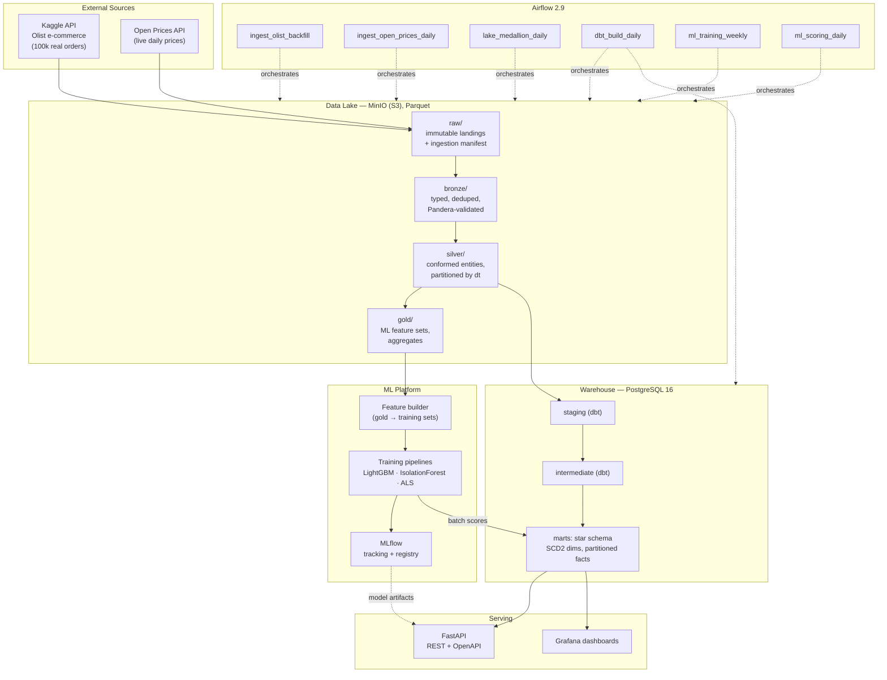
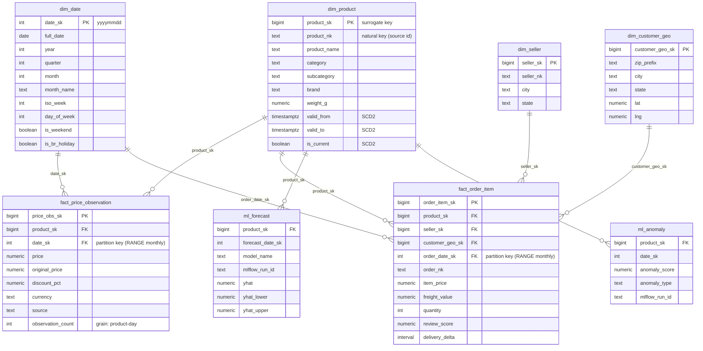
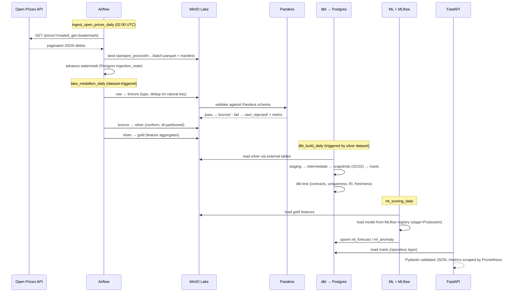

# TechTrend Platform — Architecture & Redesign Specification

**Status:** Approved for implementation · **Version:** 1.0 · **Target:** Portfolio project demonstrating 2–4 YOE Data Engineering competency

---

## 1. System Architecture

### 1.1 Guiding decisions

Every component below exists because a production team would need it — nothing is decorative.

| Decision | Choice | Rejected alternative & why |
|---|---|---|
| Data sources | Olist (real, 100k orders, Kaggle API) + Open Prices API (live, keyless) | Synthetic multiplication — instantly disqualifying to reviewers |
| Lake storage | MinIO (S3-compatible) + Parquet, medallion layers | Local folders — doesn't demonstrate object-store patterns; real S3 — costs money, blocks "clone and run" |
| Lake compute | Polars + DuckDB | Spark — massive overkill at this scale; reviewers penalize Spark-for-10MB |
| Warehouse | PostgreSQL 16 | MySQL — weaker window functions, no declarative partitioning, second-class dbt citizen |
| Transformations | dbt-core (staging → intermediate → marts) + dbt snapshots for SCD2 | Hand-written SQL scripts — no lineage, no tests, no docs |
| Orchestration | Airflow 2.9 (TaskFlow API, datasets) | Cron — no retries/backfills/observability; Dagster — fine, but Airflow is what job posts list |
| Data quality | Pandera (Python, lake-side) + dbt tests (warehouse-side) | Great Expectations — config sprawl, high maintenance, low signal for this scale |
| Serving API | FastAPI + SQLAlchemy 2.0 + Pydantic v2 | Flask — no native OpenAPI, no async, no type-driven validation |
| ML | LightGBM (demand + price), IsolationForest + robust z-score (anomaly), implicit ALS (recs) | Deep learning — unjustifiable at this data volume |
| Experiment tracking | MLflow (tracking + model registry, Postgres backend, MinIO artifact store) | — |
| Observability | Prometheus + Grafana + statsd-exporter (Airflow) + prometheus-fastapi-instrumentator | ELK — logging-only, heavier footprint |
| CI/CD | GitHub Actions: ruff, mypy, pytest, dbt build (DuckDB target), docker build, trivy scan | — |
| Packaging | uv + pyproject.toml, single monorepo, src layout | Poetry — fine, but uv is current industry momentum |

### 1.2 Component architecture



Prometheus scrapes Airflow (via statsd-exporter), FastAPI (`/metrics`), Postgres (postgres-exporter), and MinIO; Grafana ships with two provisioned dashboards: **Pipeline Health** (DAG durations, task failures, rows processed, freshness SLA) and **API Health** (p50/p95/p99 latency, RPS, error rate).

### 1.3 Key architectural properties

- **Idempotency everywhere.** Raw landings are keyed by `{source}/{load_date}/{batch_id}`; bronze/silver writes are partition overwrites; warehouse loads are `MERGE`-style upserts via dbt incremental models. Any DAG run can be safely re-executed.
- **Incremental by watermark.** Open Prices ingestion tracks a high-watermark (`max(created_at)` per source) in a small `ingestion_state` Postgres table; each run pulls only deltas. Olist is a one-time backfill DAG, replayable.
- **Contracts at boundaries.** Pandera schemas gate raw→bronze; dbt `contract: enforced` on marts gates warehouse; Pydantic gates API responses. Bad records are quarantined to `raw/_rejected/` with a reason column, never dropped silently.
- **Cloud-ready seams.** All storage access goes through an `ObjectStore` protocol (fsspec/s3fs) — swapping MinIO→S3 is one env var. Warehouse access goes through SQLAlchemy URL — Postgres→RDS/CloudSQL is one env var. Airflow → MWAA/Composer, MinIO → S3, containers → ECS/GKE. A `docs/cloud-deployment.md` maps each local component to AWS/Azure/GCP equivalents.
- **12-factor config.** Single `Settings` class (pydantic-settings), all secrets via env / `.env` (gitignored, `.env.example` committed), no credentials in code — the current `Rishi@69` hardcoded password is exactly what this eliminates.

---

## 2. Folder Structure

```
techtrend/
├── .github/
│   └── workflows/
│       ├── ci.yml                  # lint → typecheck → unit tests → dbt build (duckdb) → integration
│       └── release.yml             # docker build + push on tag, trivy scan
├── docker/
│   ├── airflow/Dockerfile
│   ├── api/Dockerfile
│   └── grafana/provisioning/       # datasources + dashboards as code
├── docker-compose.yml              # postgres, minio, airflow (web/scheduler/init),
│                                   # api, mlflow, prometheus, grafana, statsd-exporter
├── pyproject.toml                  # uv-managed; deps split into extras: [api], [ml], [dev]
├── Makefile                        # make up / seed / backfill / test / lint / demo
├── .env.example
├── src/techtrend/                  # installable package (src layout)
│   ├── config/
│   │   └── settings.py             # pydantic-settings, env-driven
│   ├── common/
│   │   ├── object_store.py         # fsspec-based lake IO (MinIO/S3 agnostic)
│   │   ├── db.py                   # SQLAlchemy engine/session factory
│   │   └── logging.py              # structlog JSON logging
│   ├── ingestion/
│   │   ├── base.py                 # Ingestor protocol: extract() → land_raw() → manifest
│   │   ├── olist.py                # Kaggle API download → raw/olist/
│   │   └── open_prices.py          # paginated REST client, watermark-based increments
│   ├── lake/
│   │   ├── bronze.py               # typing, dedup, Pandera validation, quarantine
│   │   ├── silver.py               # conformance, joins, dt-partitioned Parquet
│   │   └── gold.py                 # feature aggregates
│   ├── quality/
│   │   └── schemas.py              # Pandera DataFrameModels per dataset
│   └── ml/
│       ├── features.py             # lags, rolling stats, calendar features
│       ├── demand.py               # LightGBM regressor + backtesting
│       ├── price.py                # LightGBM quantile forecaster
│       ├── anomaly.py              # IsolationForest + robust z-score ensemble
│       ├── recommend.py            # implicit ALS on order-item interactions
│       └── registry.py             # MLflow log/load helpers
├── dags/
│   ├── ingest_olist_backfill.py
│   ├── ingest_open_prices_daily.py
│   ├── lake_medallion_daily.py     # bronze → silver → gold (Airflow datasets trigger dbt)
│   ├── dbt_build_daily.py          # dbt run + test via cosmos or BashOperator
│   ├── ml_training_weekly.py
│   └── ml_scoring_daily.py
├── dbt/techtrend_dw/
│   ├── dbt_project.yml
│   ├── profiles/                   # postgres (dev/prod) + duckdb (CI) targets
│   ├── models/
│   │   ├── staging/                # 1:1 with silver sources, renaming/typing only
│   │   ├── intermediate/           # order grain resolution, price change events
│   │   └── marts/                  # star schema (see §4), contracts enforced
│   ├── snapshots/                  # snap_products.sql → SCD2 dim_product
│   ├── seeds/                      # dim_date seed generator output
│   ├── macros/
│   └── tests/                      # singular tests: referential integrity, freshness
├── api/
│   ├── main.py                     # app factory, /metrics, /health, versioned router
│   ├── routers/                    # products, prices, analytics, forecasts, recommendations, anomalies
│   ├── repositories/               # SQL access layer (no ORM logic in routers)
│   ├── schemas/                    # Pydantic response models
│   └── deps.py
├── tests/
│   ├── unit/                       # pure functions: features, transforms, clients (mocked)
│   ├── integration/                # against dockerized postgres+minio (testcontainers)
│   └── e2e/                        # compose up → seed → run pipeline → assert API responses
├── monitoring/
│   ├── prometheus.yml
│   └── grafana/dashboards/*.json
├── scripts/
│   ├── seed_demo.py                # 5-minute demo path: bundled sample slice, no Kaggle key needed
│   └── generate_er_diagram.py
├── docs/
│   ├── architecture.md             # this document, maintained
│   ├── data-dictionary.md
│   ├── cloud-deployment.md         # AWS / Azure / GCP mapping
│   └── adr/                        # Architecture Decision Records (ADR-001 … )
└── README.md                       # badges, diagrams, screenshots, quickstart
```

Clean-architecture note: dependency direction is `api → repositories → db`, `dags → src/techtrend/*` (DAG files contain orchestration only, zero business logic — the current project's biggest structural flaw is logic living inside monolithic scripts). Every module in `src/` is import-safe and unit-testable without Docker.

---

## 3. Technology Stack Justification (interview-ready one-liners)

- **Polars over pandas** in the lake: lazy execution, predicate pushdown into Parquet, 5–20× faster on the transform workloads here; pandas remains only where scikit-learn requires it.
- **DuckDB** for ad-hoc lake queries and as the dbt CI target: dbt builds run in CI in seconds with zero services, proving the SQL is portable.
- **dbt snapshots for SCD Type 2**: `dbt snapshot` with `check` strategy on `dim_product` — validity ranges (`dbt_valid_from/to`) come for free, and it's the exact mechanism used in industry rather than hand-rolled triggers.
- **Airflow datasets** (data-aware scheduling): `dbt_build_daily` triggers on the silver dataset being updated, not on a clock — demonstrates you know modern Airflow, not 2018 Airflow.
- **MLflow with Postgres backend + MinIO artifact store**: mirrors exactly how it's deployed in production (never the local `mlruns/` folder).
- **testcontainers** for integration tests: real Postgres/MinIO per test session, no mocking of infrastructure — a strong senior signal.
- **structlog JSON logs**: machine-parseable logs are the production default; `print()` statements (current codebase) are the single fastest "student project" tell.

---

## 4. Database Design

### 4.1 Warehouse star schema (marts layer)



### 4.2 Physical design

- **Grain, stated explicitly** (Kimball discipline): `fact_price_observation` = one row per product per day per source; `fact_order_item` = one row per item line on an order.
- **Partitioning:** both fact tables use Postgres declarative `PARTITION BY RANGE (date_sk)`, monthly partitions, created by a dbt post-hook macro. Queries with date predicates get partition pruning; old partitions are cheap to detach/archive.
- **Indexing:** B-tree on every FK; composite `(product_sk, date_sk)` on both facts (covers the dominant "price history for product X" access path); BRIN on `date_sk` as a demonstration of append-only optimization; partial index `WHERE is_current` on `dim_product`.
- **Surrogate keys** generated in dbt (`dbt_utils.generate_surrogate_key`), natural keys retained for lineage back to source.
- **SCD2** on `dim_product` via dbt snapshot (`check` strategy on category/brand/name); facts join on the surrogate key valid at transaction time, so historical rows keep their historical product attributes — the textbook reason SCD2 exists, actually demonstrated.
- Current MySQL analytical views (`v_daily_price_summary`, `v_product_performance`, `v_trending_deals`) are preserved as **dbt mart models** with tests — the business logic survives, the implementation matures.

---

## 5. Data Flow



Failure semantics: any task failure → Airflow retry (exponential backoff, 3×) → on final failure, downstream tasks skip, freshness SLA metric fires in Grafana. Reruns are safe end-to-end by construction (§1.3).

---

## 6. Implementation Roadmap

Repo is fully runnable (`make up && make demo`) after **every** milestone.

| # | Milestone | Delivers | Definition of done |
|---|---|---|---|
| **M1** | Foundation & scaffold | src-layout package, pydantic settings, structlog, docker-compose (postgres+minio), Makefile, `.env.example`, pre-commit (ruff/mypy), CI skeleton | `make up` boots; `pytest` green; CI green on push |
| **M2** | Ingestion & raw layer | Kaggle Olist ingestor, Open Prices REST client with pagination + watermark, raw landings with manifests, bundled sample slice for keyless demo | Both sources land Parquet in MinIO; unit tests with mocked HTTP; idempotent re-runs verified |
| **M3** | Medallion lake + quality | bronze/silver/gold in Polars, Pandera schemas, quarantine path, partitioned Parquet | Silver/gold materialize from raw; rejected-row test fixture proves quarantine |
| **M4** | Warehouse + dbt | Full dbt project: staging→marts, SCD2 snapshot, partitioned facts (macro), contracts, ~40 dbt tests, dbt docs | `dbt build` green on Postgres and on DuckDB (CI); ER diagram generated from live schema |
| **M5** | Airflow orchestration | All 6 DAGs, dataset-driven scheduling, retries/SLAs, Airflow in compose | Full pipeline runs end-to-end from Airflow UI; backfill demonstrated |
| **M6** | ML platform | Feature builder, 4 models, time-series cross-validation/backtesting, MLflow tracking + registry, scoring DAG writes to marts | Each model logged to MLflow with metrics; forecasts/anomalies queryable in warehouse |
| **M7** | Serving + observability | FastAPI (12+ endpoints, pagination, versioned `/api/v1`, OpenAPI), Prometheus + Grafana provisioned dashboards | `docs` endpoint complete; Grafana shows pipeline + API dashboards with live data |
| **M8** | Hardening & polish | Integration tests (testcontainers), e2e test, release workflow + trivy, ADRs, data dictionary, cloud-deployment guide, README with badges/screenshots/diagrams | CI matrix fully green; a stranger can clone → `make demo` → working dashboard in <10 min |

**What is deliberately preserved from your current project:** the star-schema domain (products/dates/pricing facts), the three analytical views' business logic (as dbt marts), the trend-detection rule (as one input to the anomaly ensemble), and clustering (kept as a `product_segments` gold feature feeding the recommender — not marketed as "AI").

**What is deliberately deleted:** synthetic time-series multiplication, hardcoded credentials, `iterrows()` loads, `DELETE FROM` full refreshes, modulo-based category assignment, emoji-driven `print()` logging, and all grading-rubric language in the docs.
